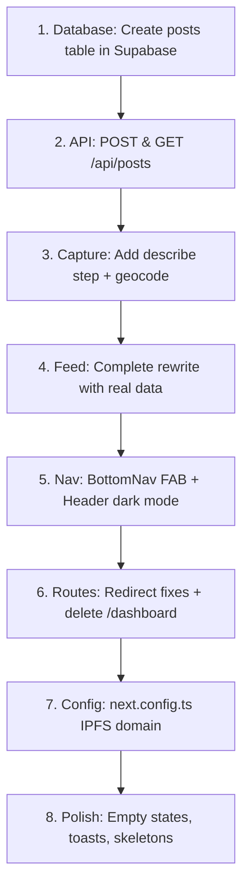

# Feed System — End-to-End Implementation Plan

## Background & Problem Statement

The Obelisk application currently has a working **Capture** flow (camera → liveness check → Lighthouse IPFS upload) and a **Feed** page with hardcoded mock data. There is no pipeline connecting the two — captured moments are archived to IPFS but never saved to the database or displayed in the feed.

The goal is to implement the full **Capture → Enrich → Archive → Display** pipeline so that real, verified human moments appear in the social feed.

---

## Architecture Decision: Where Does What Live?

| Data | Storage | Why |
|---|---|---|
| **Image binary** | **Lighthouse (IPFS/Filecoin)** | Permanent, decentralized, content-addressed |
| **Proof JSON** (hash, signature, GPS, sensors) | **Lighthouse (IPFS/Filecoin)** | Immutable sidecar to the image |
| **On-chain anchor** (image CID + proof CID) | **Avalanche Fuji smart contract** | Blockchain notarization — proves *when* and *by whom* |
| **Social metadata** (title, caption, pillar, vouches) | **Supabase `posts` table** | Fast queries for feed rendering, filtering, pagination |

> [!IMPORTANT]
> **Title and description live in Supabase**, not on-chain. They are social/editorial data that users may want to edit. The immutable proof (image hash, GPS, timestamp) is what goes on-chain. Supabase acts as the **queryable index**, the blockchain acts as the **notary**.

---

## Resolved Questions

### 1. Smart Contract — ❌ Deferred
No contract is deployed on Avalanche Fuji yet. The plan is that when users accumulate enough vouches, they earn an SBT (Soulbound Token). This is a **post-MVP feature**. For now, the `tx_hash` and `contract_address` columns remain nullable in the `posts` table. The existing `useSmartAccount.ts` and `pimlico.ts` files stay untouched.

### 2. Pimlico API Key — ❌ Not Configured
The Pimlico API key is not set up. Gas sponsorship and smart account features are deferred until the contract is deployed. No blockchain writes in this implementation.

### 3. Feed Scope — Global Feed
Following the standard social app pattern (Instagram, X/Twitter), the feed will show **all users' posts globally**, ordered by newest first. Pillar filter tabs let users narrow by category. A personal "My Archive" profile view is a future feature.

### 4. Lighthouse Key — ✅ Client-Side Acceptable for MVP
`NEXT_PUBLIC_LIGHTHOUSE_API_KEY` remains client-side for now. A server-side proxy is a production hardening task.

---

## Proposed Changes

---

### Component 1: Database Schema

#### [MODIFY] [supabase.editor](file:///c:/Users/earlo/Desktop/Obelisk/supabase.editor)

Add a `posts` table to store the social/queryable layer of each archived moment:

```sql
CREATE TABLE public.posts (
  id uuid DEFAULT gen_random_uuid() PRIMARY KEY,
  user_id uuid NOT NULL REFERENCES public.users(id) ON DELETE CASCADE,
  
  -- Social metadata (editable, queryable)
  title text NOT NULL,
  caption text,
  pillar text NOT NULL,
  location_name text,
  
  -- Geo coordinates (from capture proof)
  latitude double precision,
  longitude double precision,
  
  -- IPFS references (permanent storage)
  image_cid text NOT NULL,
  proof_cid text NOT NULL,
  image_url text NOT NULL,
  proof_url text NOT NULL,
  
  -- Blockchain anchoring
  tx_hash text,
  contract_address text,
  chain_id int DEFAULT 43113,
  
  -- Verification
  liveness_score double precision,
  is_verified boolean DEFAULT false,
  vouch_count int DEFAULT 0,
  
  -- Timestamps
  captured_at timestamptz NOT NULL,
  created_at timestamptz DEFAULT now(),
  updated_at timestamptz DEFAULT now()
);

CREATE INDEX idx_posts_user_id ON public.posts (user_id);
CREATE INDEX idx_posts_pillar ON public.posts (pillar);
CREATE INDEX idx_posts_created_at ON public.posts (created_at DESC);
```

---

### Component 2: Server-Side API Routes

#### [NEW] `app/api/posts/route.ts`

**`POST /api/posts`** — Creates a new post in Supabase after the client has uploaded to Lighthouse.

- Auth: Reads `sb-access-token` cookie to identify the user
- Validates body with Zod (title, caption, pillar, CIDs, location, etc.)
- Inserts into `posts` table
- Returns the created post

**`GET /api/posts`** — Fetches paginated feed posts, joined with the `users` table for author info.

- Query params: `?page=1&limit=20&pillar=environment`
- Joins `users` table to include `handle`, `avatar_url`, `humanity_score`
- Orders by `created_at DESC`
- Returns `{ posts: [...], hasMore: boolean }`

---

### Component 3: Capture Flow Enhancement (Major UI/UX Change)

The current capture page goes straight from preview → archive. Users have no way to add context to their moment.

**Current flow**: `camera` → `preview + proof` → `archive` → `done (dead end)`

**New flow**: `camera` → `preview` → `describe your moment` → `archiving + saving` → `success` → `redirect to /feed`

#### [MODIFY] [page.tsx](file:///c:/Users/earlo/Desktop/Obelisk/app/capture/page.tsx)

**UI/UX changes:**

1. **Add a "Describe Your Moment" step** — New full-screen dark form that appears after preview confirmation:
   - **Title input** (required, 3-100 chars) — clean, large text input
   - **Caption textarea** (optional, max 500 chars) — smaller descriptive text
   - **Pillar selector** — horizontal scrollable pill/chip buttons using the 6 existing pillars (Identity, Knowledge, Culture, Environment, Innovation, Community) with their icons
   - **Location display** — auto-populated from GPS via reverse geocoding, shown as a read-only chip with a MapPin icon. User can tap to edit manually.
   - All styled to match the existing dark capture aesthetic (black background, cyan accents, glassmorphism cards)

2. **Change "ARCHIVE MOMENT" button behavior** — Instead of just uploading to Lighthouse, it now:
   - Uploads image + proof to Lighthouse (existing `archiveMoment()`)
   - Then calls `POST /api/posts` with the CIDs + social metadata
   - Shows a progress indicator with steps: "Uploading to IPFS..." → "Saving to archive..." → "Done!"

3. **Replace the "CAPTURE ANOTHER" dead-end** with a proper success screen:
   - Green checkmark animation
   - "Your moment is now in the archive" message
   - Two CTAs: **"View in Feed"** (→ `/feed`) and **"Capture Another"** (reset)

4. **Update the back arrow** — Currently links to `/` which is meaningless. Change to navigate to `/feed`.

#### [NEW] `lib/utils/geocode.ts`

Reverse geocoding utility using the free Nominatim API to convert lat/lng → human-readable location name (e.g., "Olongapo City, Philippines").

---

### Component 4: Feed Page Redesign (Major UI/UX Change)

The current `feed/page.tsx` has **376 lines** of hardcoded mock data and inline SVG icon components, plus a duplicated sidebar that conflicts with the `DashboardLayout` shell.

#### [MODIFY] [page.tsx](file:///c:/Users/earlo/Desktop/Obelisk/app/feed/page.tsx)

**Complete rewrite. Specific UI/UX changes:**

1. **Delete the entire inline sidebar** (lines 49-87) — The `DashboardLayout` from `feed/layout.tsx` already provides the Header and BottomNav. The feed page should NOT render its own sidebar. It should just be the content area.

2. **Delete all inline SVG icon components** (lines 189-374) — Replace with `lucide-react` imports (`Globe`, `MapPin`, `ShieldCheck`, `Database`, `Link2`, `ArrowUpRight`, `Share2`, `Clock`)

3. **Delete hardcoded `feedPosts` array** — Replace with real data fetched via `@tanstack/react-query`:
   ```tsx
   const { data, isLoading } = useQuery({
     queryKey: ["feed", activeFilter],
     queryFn: () => fetch(`/api/posts?pillar=${activeFilter}`).then(r => r.json()),
   });
   ```

4. **Redesign the post card** to show real data:
   - **Header**: Author avatar (gradient circle fallback) + `@handle` + relative timestamp + location
   - **Pillar badge**: Colored chip in top-right
   - **Image**: Loaded from `post.image_url` (Lighthouse gateway). Use `next/image` with `unoptimized` since it's an IPFS URL
   - **Verification overlay**: Bottom-left badge showing liveness status
   - **Crypto proof section**: Collapsible/expandable panel showing IPFS CID, proof link, chain info (if tx_hash exists)
   - **Actions bar**: Vouch button (with count) + Share button

5. **Replace the "Global Feed / Local Map" toggle tabs** with **pillar filter tabs**:
   - `All` | `Identity` | `Knowledge` | `Culture` | `Environment` | `Innovation` | `Community`
   - Horizontally scrollable on mobile
   - Active tab has the cyan bottom border

6. **Add empty state** — When no posts exist:
   - Large camera icon
   - "No moments archived yet"
   - "Be the first to capture a real human moment"
   - CTA button: **"Open Camera"** → navigates to `/capture`

7. **Add loading skeleton** — Pulsing card placeholders while data loads

8. **Wrap content in `MainContent` padding** — Use `pb-20 pt-16` to account for fixed Header (top) and BottomNav (bottom)

#### [MODIFY] [layout.tsx](file:///c:/Users/earlo/Desktop/Obelisk/app/feed/layout.tsx)

- Change `user?.full_name` to `user?.handle` on line 25 (identity migration fix)

---

### Component 5: Navigation & Layout Overhaul (UI/UX Change)

#### [MODIFY] [BottomNav.tsx](file:///c:/Users/earlo/Desktop/Obelisk/components/dashboard/BottomNav.tsx)

**UI/UX changes:**

1. **Update nav items** — Replace the current list:
   ```
   Before:                          After:
   Home → /dashboard               Feed → /feed
   Discover → /discover            Explore → /explore (placeholder)
   Capture → /capture              Capture → /capture (elevated button)
   Community → /community          Badges → /badges (placeholder)
   Profile → /profile              Profile → /profile (placeholder)
   ```

2. **Elevate the Capture button** — The center "Capture" button should be visually elevated like a FAB (floating action button):
   - Larger icon (28px vs 22px for others)
   - Filled circular background with the indigo→cyan gradient
   - White icon color
   - Slight negative top offset (`-top-3`) to pop out of the nav bar
   - This matches the MVP spec: "Central Capture Button" pattern

3. **Active state color** — Change from `text-blue-500` to `text-indigo-600` to match the app's indigo/cyan design language

#### [MODIFY] [NavItem.tsx](file:///c:/Users/earlo/Desktop/Obelisk/components/dashboard/NavItem.tsx)

- Update active color from `text-blue-500` to `text-indigo-600`

#### [MODIFY] [Header.tsx](file:///c:/Users/earlo/Desktop/Obelisk/components/dashboard/Header.tsx)

**UI/UX changes:**

1. **Add dark mode support** — Currently hardcoded `bg-white` and `text-slate-900`. Add `dark:bg-slate-950 dark:border-slate-800 dark:text-slate-100` classes
2. **Add dark mode to dropdown** — The dropdown menu is also hardcoded white. Add dark mode classes
3. **Fix the `username` display** — Ensure it uses `handle` not `full_name`

#### [MODIFY] [DashboardLayout.tsx](file:///c:/Users/earlo/Desktop/Obelisk/components/dashboard/DashboardLayout.tsx)

No structural changes needed — the Header + children + BottomNav shell is correct. Just ensure dark mode works on the wrapper `div`.

---

### Component 6: Redirect & Route Updates

#### [MODIFY] [page.tsx](file:///c:/Users/earlo/Desktop/Obelisk/app/onboarding/page.tsx)

- Change `router.replace("/dashboard")` → `router.replace("/feed")` in `handleComplete`

#### [MODIFY] [page.tsx](file:///c:/Users/earlo/Desktop/Obelisk/app/(auth)/signin/page.tsx)

- Change redirect targets from `/dashboard` to `/feed` in the `useEffect` that fires after authentication

#### [MODIFY] [proxy.ts](file:///c:/Users/earlo/Desktop/Obelisk/proxy.ts)

Already updated by user — `/dashboard` → `/feed` everywhere. ✅

#### [DELETE] `app/dashboard/` directory

The old `/dashboard` route is now dead. The feed page replaces it entirely. Delete `app/dashboard/page.tsx` and any layout files to avoid confusion.

---

### Component 7: Next.js Config for IPFS Images

#### [MODIFY] [next.config.ts](file:///c:/Users/earlo/Desktop/Obelisk/next.config.ts)

Add the Lighthouse IPFS gateway domain to `images.remotePatterns` so `next/image` can load images from it:

```ts
images: {
  remotePatterns: [
    { protocol: "https", hostname: "gateway.lighthouse.storage" },
  ],
},
```

---

## UI/UX Summary — Visual Changes at a Glance

| Screen | Current State | New State |
|---|---|---|
| **Feed page** | Hardcoded data, inline sidebar, inline SVG icons, no real images | Clean card-based feed, real IPFS images, pillar filters, empty state, loading skeletons |
| **Feed sidebar** | Duplicated sidebar inside page.tsx | **Removed** — Header + BottomNav from DashboardLayout is the shell |
| **Capture page** | Camera → Preview → Archive → dead end | Camera → Preview → **Describe** (title/caption/pillar) → Archive → **Success with CTA** |
| **Capture back button** | Links to `/` (broken) | Links to `/feed` |
| **Bottom nav** | 5 generic items, blue active color, flat capture button | 5 updated items, indigo active color, **elevated gradient capture FAB** |
| **Header** | White-only, no dark mode | Full dark mode support |
| **Nav active color** | `text-blue-500` | `text-indigo-600` (matches design language) |
| **Post card** | Static mock with "Arweave" + "Base" references | Real data: Lighthouse CID, Avalanche Fuji chain, live IPFS images, expandable proof panel |
| **All redirects** | `/dashboard` | `/feed` |

---

## Implementation Order



## Verification Plan

### Automated Tests
- `npx tsc --noEmit` — Full type check passes after each component
- `npm run build` — Production build succeeds

### Manual Verification
1. **Capture flow**: `/capture` → take photo → verify "Describe" step appears → fill title/caption/pillar → click Archive → verify Lighthouse upload + Supabase insert → verify redirect to `/feed`
2. **Feed rendering**: Navigate to `/feed` → verify post card renders with IPFS image, `@handle`, pillar badge, proof metadata
3. **Empty state**: New user with no posts sees the empty state CTA → clicking "Open Camera" navigates to `/capture`
4. **Bottom nav**: All 5 items navigate correctly, capture button is visually elevated, active states use indigo
5. **Dark mode**: Header, dropdown, and feed all render correctly in dark mode
6. **Redirects**: Sign in → onboarding → completing onboarding all route to `/feed`

---

## Scope Exclusions (Post-MVP)

- **Smart contract deployment & on-chain minting** — `tx_hash` field is nullable. Contract will be deployed later. When users accumulate enough vouches, they earn an SBT (Soulbound Token) minted on Avalanche Fuji via the Pimlico paymaster.
- **Pimlico gas sponsorship** — API key not configured. `useSmartAccount.ts` and `pimlico.ts` stay as-is.
- **Vouch system** — Vouch button present in feed UI but non-functional (counter only)
- **AI detection** — ML verification service (Hive/Rekognition) not integrated yet
- **SBT minting** — Triggered by vouch threshold (future)
- **Image optimization** — Raw IPFS gateway images for now; CDN proxy later
- **Infinite scroll** — "Load More" button for MVP; intersection observer later
- **Personal profile / "My Archive"** — Future feature, MVP is global-only
